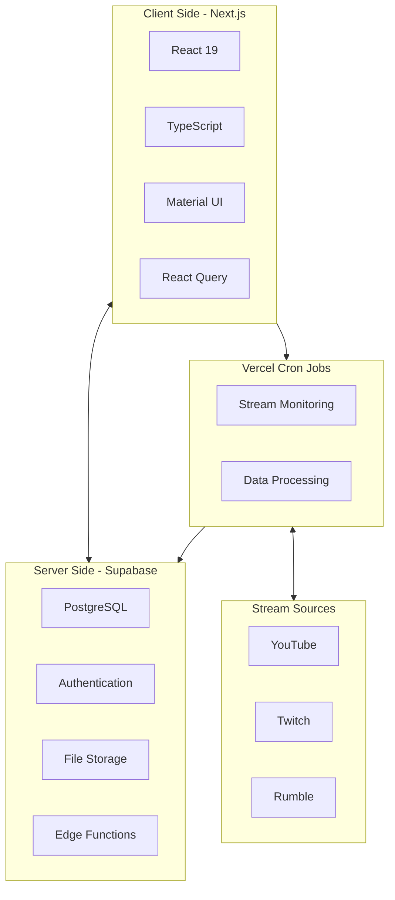
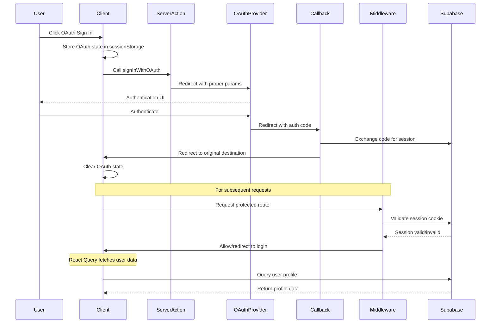
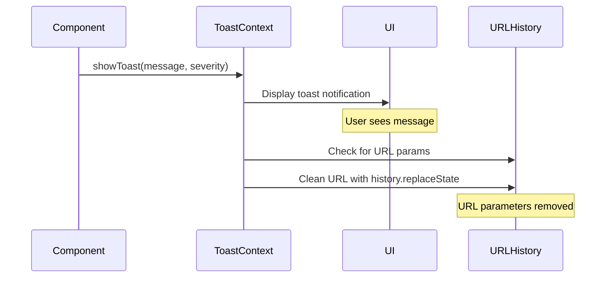
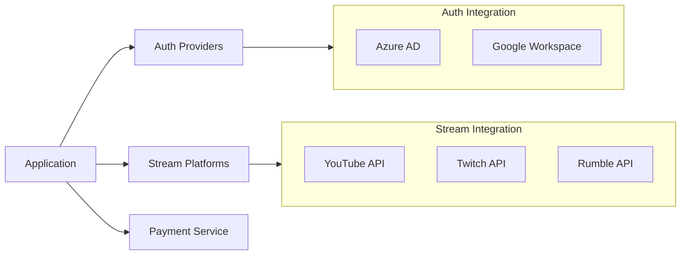
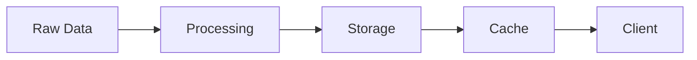

# StreamTrack - System Patterns

## System Architecture



## Core Design Patterns

### 1. Authentication & Authorization

- JWT-based authentication flow
- Role-based access control (RBAC)
- Row Level Security (RLS) in database
- Multi-provider SSO integration
- Server-side authentication actions for consistent auth flows
- OAuth state management with sessionStorage
- Middleware-based authentication checks
- React Query for user profile data management
- Minimized state manipulation in AuthContext
- **API Secret Authentication for Monitoring Endpoints**

#### OAuth Authentication Flow



#### HMAC Authentication Pattern

For internal endpoints (cron jobs, webhooks, automated tasks), we use HMAC-SHA256 signature authentication handled in middleware:

```typescript
// API routes that require HMAC signature authentication
const HMAC_AUTH_API_PATHS = [
  '/api/monitor/check-channels',
  '/api/monitor/check-streams',
  '/api/monitor/check-rumble-daily',
  '/api/discord-bot',
  '/api/links/fetch-metadata',
  '/api/click',
  '/api/rumble/sentiment',
  '/api/oauth/sync-tokens',
];
```

**Benefits:**

- Centralized authentication logic in middleware
- HMAC signatures are more secure than simple secret comparison
- Consistent error responses across internal endpoints
- No duplicated auth code in individual routes
- Easier to audit and maintain
- Routes focus on business logic, not authentication

**Usage:**

```bash
# Generate HMAC signature for empty body (GET requests)
SIGNATURE=$(echo -n "" | openssl dgst -sha256 -hmac "$INTERNAL_HMAC_SECRET" | cut -d' ' -f2)

# Rumble monitoring endpoints (pages parameter)
curl -H "x-internal-signature: $SIGNATURE" "https://yourdomain.com/api/monitor/check-rumble-daily"
curl -H "x-internal-signature: $SIGNATURE" "https://yourdomain.com/api/monitor/check-rumble-daily?pages=10"
curl -H "x-internal-signature: $SIGNATURE" "https://yourdomain.com/api/monitor/check-rumble-daily?pages=100"

# Other monitoring endpoints
curl -H "x-internal-signature: $SIGNATURE" "https://yourdomain.com/api/monitor/check-channels"
curl -H "x-internal-signature: $SIGNATURE" "https://yourdomain.com/api/monitor/check-streams"

# Discord bot endpoint
curl -H "x-internal-signature: $SIGNATURE" "https://yourdomain.com/api/discord-bot"
```

**Rumble Collection Configuration:**

- **Pages Parameter**: `pages=N` where N is 1-100 (default: 3)
- **Subscription Requirement**: Premium, enterprise, or unlimited subscription required for any scraping
- **Rate Limiting**: Automatic delays based on page count (1.5s for ≤10 pages, 3s for >10 pages)
- **Capture Type**: Automatically set to 'weekly' for pages ≥50, 'daily' for pages <50

### 2. Real-time Data Flow

- WebSocket-based live updates
- Selective subscription patterns
- Optimistic UI updates
- Fallback mechanisms

### 3. State Management

- Server state: React Query
- Client state: Zustand
- Real-time sync with Supabase
- Caching strategies

### 4. Data Access Patterns

- Repository pattern for data access
- Query optimization with materialized views
- Connection pooling
- Edge caching strategy

## UI/UX Patterns

### 1. Toast Notifications

- Centralized ToastProvider component for consistent notification display
- Global toast service that removes URL query parameters after displaying notifications
- Eliminates duplicate notification logic across components
- Automatic URL cleanup after error/success messages from redirects

#### Toast and URL Parameter Flow



#### Implementation Best Practices

- Always use the global ToastProvider for all notifications
- Never implement component-level notification systems
- URL parameters are automatically cleared after displaying related messages
- Import useToast() hook to access the toast service from any component

## Technical Decisions

### Frontend Architecture

- Next.js for server-side rendering
- TypeScript for type safety
- MUI for consistent UI components
- React Query for data fetching
- Emotion for styled components

### Backend Architecture

- Supabase for managed PostgreSQL
- Edge Functions for serverless API
- Real-time subscriptions
- Automated backups

### Monitoring Service

- Vercel Cron Jobs (1 and 5 minute intervals)
- Parallel processing
- Comprehensive logging
- Error handling patterns

## Integration Patterns

### 1. External APIs



### 2. Data Processing



## Security Patterns

### Authentication Flow

1. Client initiates auth
2. Provider verification
3. JWT token generation
4. Session management

### Data Security

- Encryption at rest
- Secure API endpoints
- Input validation
- HTTPS enforcement

## Performance Patterns

### Caching Strategy

- Client-side caching
- Server-side caching
- Edge caching
- Cache invalidation

### Query Optimization

- Materialized views
- Strategic indexing
- Query planning
- Connection pooling

## Development Patterns

### Code Organization

- Feature-based structure
- Shared components
- Type definitions
- Utility functions

### Testing Strategy

- Unit tests with Jest
- Integration tests
- E2E with Playwright
- CI/CD pipeline

## Deployment Patterns

### Frontend (Vercel)

- Edge network distribution
- Zero-downtime updates
- Preview deployments
- Automated rollbacks

### Backend (Supabase)

- Managed PostgreSQL
- High availability
- Disaster recovery
- Automatic scaling
